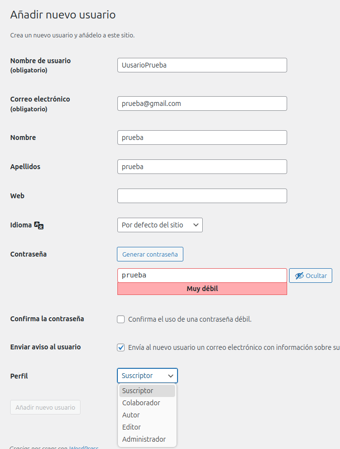
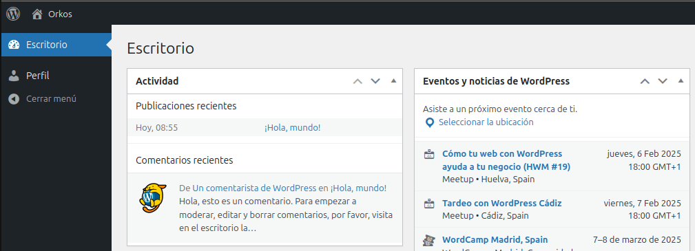
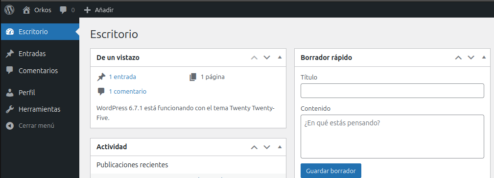
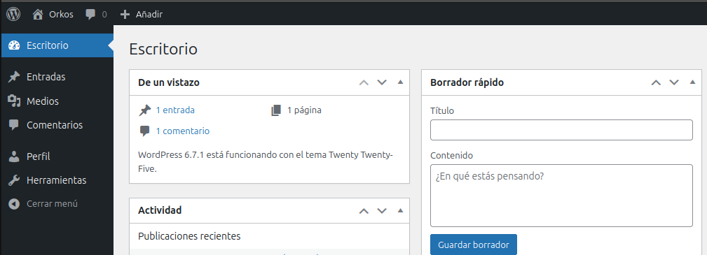
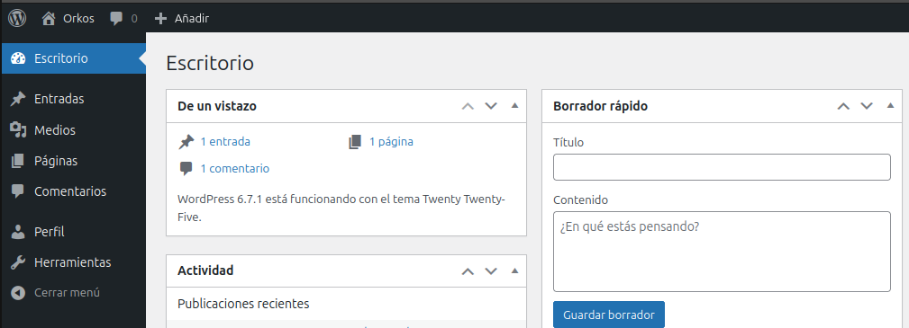
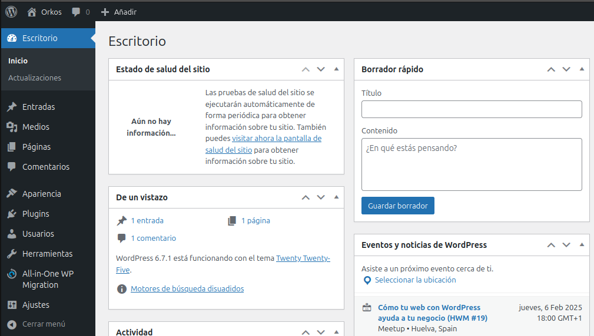

Gestionar Usarios en Wordpress

Vamos a ver que tipos de usuarios que se pueden crear se puede elegir que tipo de usuario queremos en esta pestaña donde podemos elegir entre 5 tipos de usuarios

Vamos a ver que podemos gestionar en cada uno de ellos

Usuario Subscriptor

Este usuario solo puede leer el contenido es el usuario mas basico de wordpress como podemos ver en la siguiente imagen de su escritorio

Usuario Coloborador

Este usuario tiene casi los mismos permisos que el Subscriptor pero en cambio este puede crear sus entradas pero no puede publicarlas

Usuario Autor

Tiene casi los mismos permisos que un Colaborador pero en este caso los usuarios Autores si pueden publicar sus entradas

Usuario Editor

Es el rol que se encarga de todo lo que tiene que ver con la publicación de contenidos. Básicamente, puede hacer de todo menos instalar plugins y gestionar usuarios.

Usuario Administrador

Es el unico usuario que puede hacer de todo ya que tiene todos los privilegios como por ejemplo poder instalar plugins o gestionar usuarios

